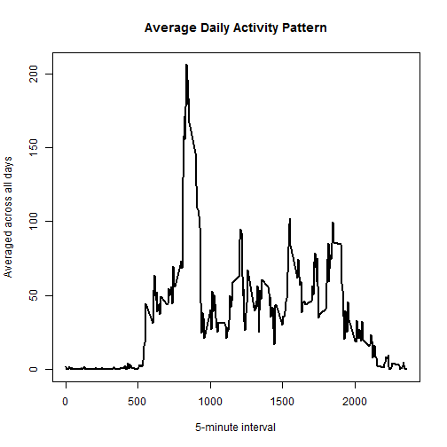

=============================================================================
Course Project 1
title: 'Reproducible Research: Peer Assessment 1'
=============================================================================


## Loading and preprocessing the data


```r
library(lattice)
setwd("D:/data learning/repdata-data-activity")
raw_data<-read.csv("activity.csv", stringsAsFactors=FALSE)
head(raw_data)
```

```
##   steps       date interval
## 1    NA 2012-10-01        0
## 2    NA 2012-10-01        5
## 3    NA 2012-10-01       10
## 4    NA 2012-10-01       15
## 5    NA 2012-10-01       20
## 6    NA 2012-10-01       25
```

## What is mean total number of steps taken per day?


```r
totalSteps <- aggregate(raw_data$steps, by=list(raw_data$date), FUN=sum, na.rm=TRUE)
head(totalSteps)
```

```
##      Group.1     x
## 1 2012-10-01     0
## 2 2012-10-02   126
## 3 2012-10-03 11352
## 4 2012-10-04 12116
## 5 2012-10-05 13294
## 6 2012-10-06 15420
```

```r
names(totalSteps) <- c("Date","Total")
##Histogram of the total number of steps taken each day
hist(totalSteps$Total, main="Total Number of Steps Taken Each Day",xlab = "Steps",col= "red")
```


```r
##Mean and median number of steps taken each day
summary(totalSteps)
```

```
##      Date               Total      
##  Length:61          Min.   :    0  
##  Class :character   1st Qu.: 6778  
##  Mode  :character   Median :10395  
##                     Mean   : 9354  
##                     3rd Qu.:12811  
##                     Max.   :21194
```

```r
mean(totalSteps$Total)
```

```
## [1] 9354.23
```

```r
median(totalSteps$Total)
```

```
## [1] 10395
```

According to the summary, 

Mean is 9354.23

Median is 10395


## What is the average daily activity pattern?


```r
averageData <- aggregate(raw_data$steps,by=list(raw_data$interval),FUN=mean,na.rm=T)
head(averageData)
```

```
##   Group.1         x
## 1       0 1.7169811
## 2       5 0.3396226
## 3      10 0.1320755
## 4      15 0.1509434
## 5      20 0.0754717
## 6      25 2.0943396
```

```r
names(averageData)<-c("Interval","Average")
plot2 <- plot(x=averageData$Interval,y=averageData$Average, type="l",lwd=2,xlab = "5-minute interval", ylab = "Averaged across all days",main = "Average Daily Activity Pattern")
```



```r
##Which 5-minute interval, on average across all the days in the dataset, contains the maximum number of steps?
max_steps <- which.max(averageData$Average)
max_steps
```

```
## [1] 104
```

```r
averageData[104,,]
```

```
##     Interval  Average
## 104      835 206.1698
```

## Imputing missing values


```r
NA_Data <- sum(is.na(raw_data$steps))
NA_Data
```

```
## [1] 2304
```

```r
NA_Value <- which(is.na(raw_data$steps))
##mean value
mean_value <- rep(mean(raw_data$steps,na.rm=T),times=length(NA_Value))
raw_data[NA_Value,"steps"] <- mean_value
head(raw_data)
```

```
##     steps       date interval
## 1 37.3826 2012-10-01        0
## 2 37.3826 2012-10-01        5
## 3 37.3826 2012-10-01       10
## 4 37.3826 2012-10-01       15
## 5 37.3826 2012-10-01       20
## 6 37.3826 2012-10-01       25
```

```r
totalSteps1 <- aggregate(raw_data$steps, by=list(raw_data$date), FUN=sum,na.rm=TRUE)
head(totalSteps1)
```

```
##      Group.1        x
## 1 2012-10-01 10766.19
## 2 2012-10-02   126.00
## 3 2012-10-03 11352.00
## 4 2012-10-04 12116.00
## 5 2012-10-05 13294.00
## 6 2012-10-06 15420.00
```

```r
names(totalSteps1) <- c("Date","Total")
hist(totalSteps1$Total, main="Total Number of Steps Taken Each Day",xlab = "Steps",col= "blue")
```


```r
summary(totalSteps1)
```

```
##      Date               Total      
##  Length:61          Min.   :   41  
##  Class :character   1st Qu.: 9819  
##  Mode  :character   Median :10766  
##                     Mean   :10766  
##                     3rd Qu.:12811  
##                     Max.   :21194
```

```r
mean(totalSteps1$Total)
```

```
## [1] 10766.19
```

```r
median(totalSteps1$Total)
```

```
## [1] 10766.19
```

According to the result, 

Mean is 10766.19.

Median is 10766.19.

## Are there differences in activity patterns between weekdays and weekends?


```r
##set weekday and weekend.
raw_data2<-data.frame(data=raw_data$date,weekday=weekdays(as.Date(totalSteps$Date)),steps=raw_data$steps,interval=raw_data$interval)
head(raw_data2)
```

```
##         data   weekday   steps interval
## 1 2012-10-01    Monday 37.3826        0
## 2 2012-10-01   Tuesday 37.3826        5
## 3 2012-10-01 Wednesday 37.3826       10
## 4 2012-10-01  Thursday 37.3826       15
## 5 2012-10-01    Friday 37.3826       20
## 6 2012-10-01  Saturday 37.3826       25
```

```r
raw_data3 <- cbind(raw_data2,daytype=ifelse(raw_data2$weekday == "Saturday" |raw_data2$weekday == "Sunday", "weekend", "weekday"))
head(raw_data3)
```

```
##         data   weekday   steps interval daytype
## 1 2012-10-01    Monday 37.3826        0 weekday
## 2 2012-10-01   Tuesday 37.3826        5 weekday
## 3 2012-10-01 Wednesday 37.3826       10 weekday
## 4 2012-10-01  Thursday 37.3826       15 weekday
## 5 2012-10-01    Friday 37.3826       20 weekday
## 6 2012-10-01  Saturday 37.3826       25 weekend
```

```r
mean_data3 <- aggregate(raw_data3$steps,by=list(raw_data3$daytype,raw_data3$weekday, raw_data3$interval), mean)
names(mean_data3) <- c("daytype", "weekday", "interval", "mean")
head(mean_data3)
```

```
##   daytype  weekday interval      mean
## 1 weekday   Friday        0  4.153622
## 2 weekday   Monday        0  4.153622
## 3 weekend Saturday        0  0.000000
## 4 weekend   Sunday        0  0.000000
## 5 weekday Thursday        0 21.836711
## 6 weekday  Tuesday        0  8.307244
```

```r
xyplot(mean ~ interval | daytype, mean_data3, type="l", lwd=1, xlab="Interval", ylab="Number of steps", layout=c(1,2))
```


